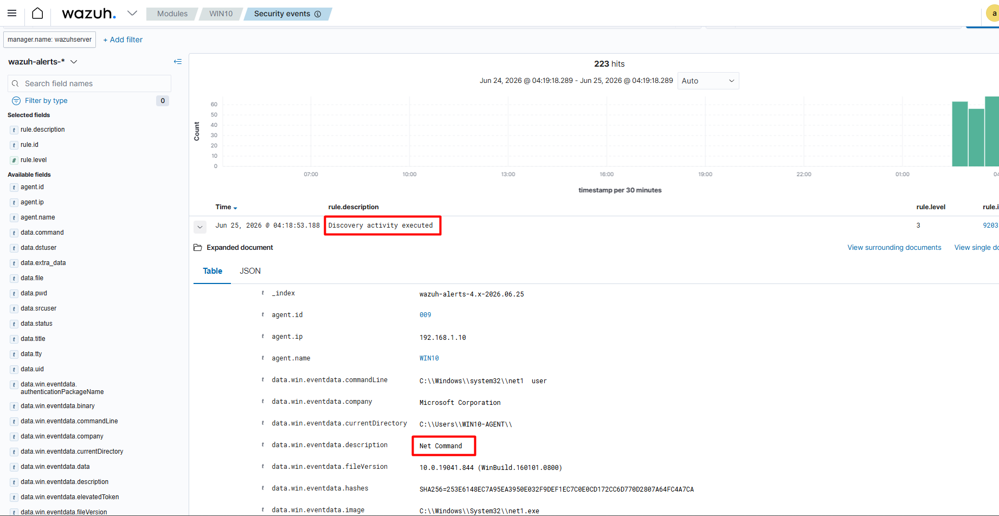
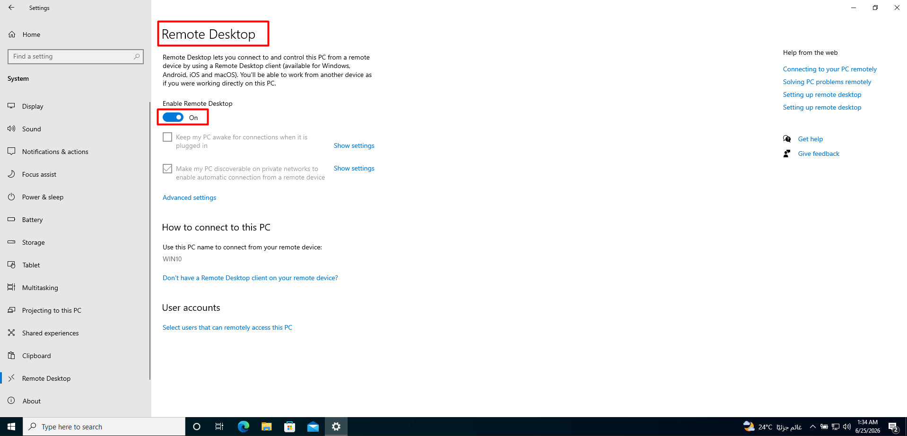
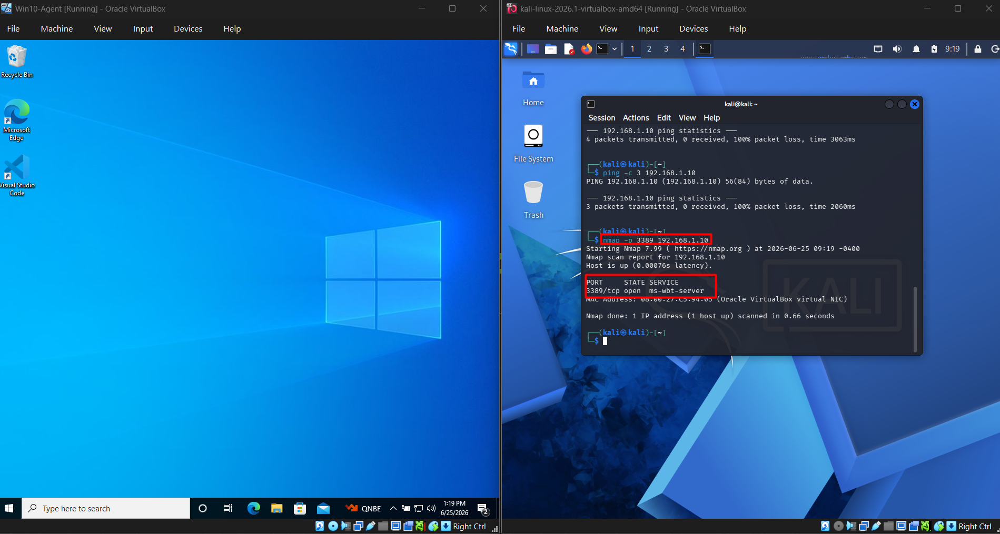
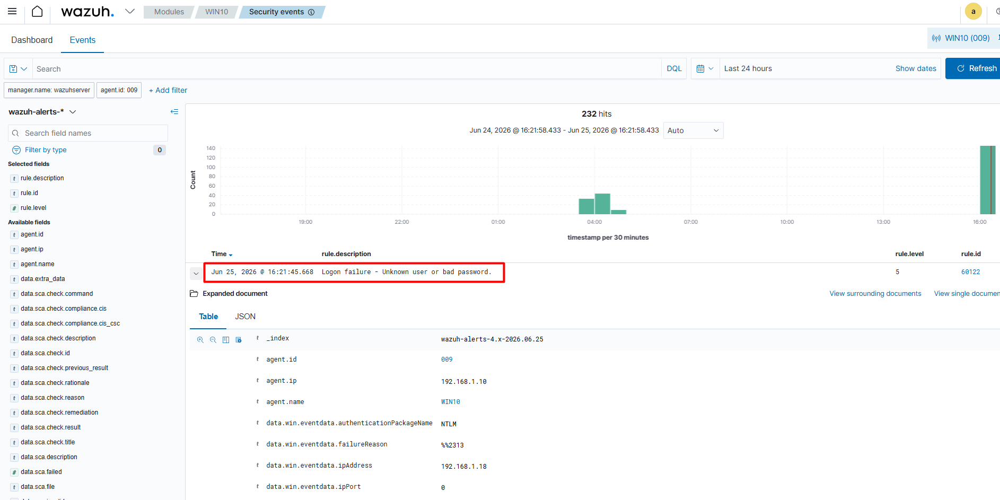
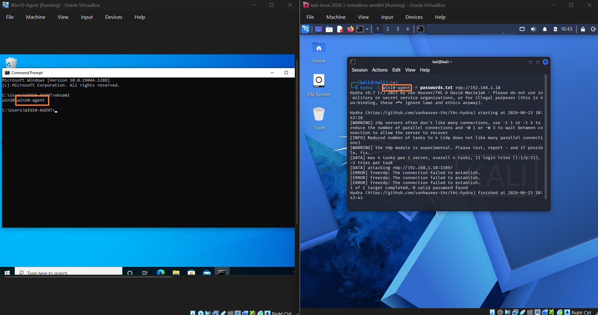
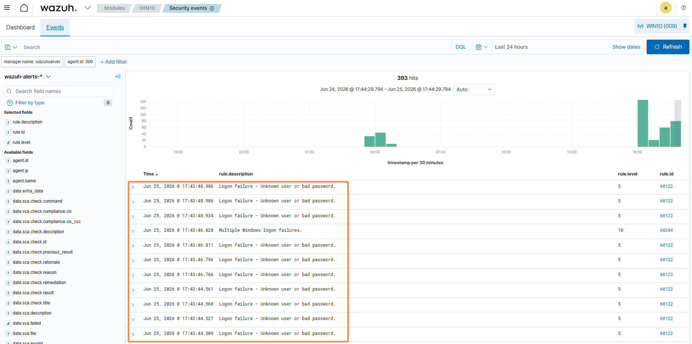

# Brute Force Detection Lab (Mini SOC)

> **Professional Edition**

## Table of Contents
- Overview
- Objective
- Lab Architecture
- Tools and Technologies
- Lab Setup
  - Wazuh Installation
  - Windows Preparation
  - Sysmon Installation
  - Wazuh Agent Installation
  - Agent Registration
  - Connectivity Verification
- Troubleshooting
- Learning Outcomes
- Next Steps

---

## Overview

This project demonstrates the implementation of a mini Security Operations Center (SOC) lab to simulate and detect brute force attacks. The lab provides hands-on experience in monitoring, log analysis, and threat detection using a SIEM solution.

---

## Objective

The objective of this project is to simulate brute force attack scenarios and analyze how these attacks can be detected using Wazuh SIEM. The project focuses on understanding log collection, event correlation, and alert generation.

---

## Lab Architecture

The lab environment consists of the following components:

* **Attacker:** Kali Linux machine used to simulate brute force attacks
* **Victim:** Windows machine acting as the target system
* **SIEM:** Wazuh deployed on an Ubuntu server for monitoring and analysis

---

## Tools and Technologies

* **Wazuh** – SIEM platform for log collection and threat detection
* **Kali Linux** – Used for attack simulation
* **Windows** – Target system
* **Sysmon** – Provides detailed logging on Windows

---

## Lab Setup

### 1. Wazuh Setup

#### System Preparation

The installation was performed on an Ubuntu Server. The system was updated before installation:

```bash
sudo apt update && sudo apt upgrade -y
```

---

#### Download Installer

The official Wazuh installation script was downloaded:

```bash
curl -sO https://packages.wazuh.com/4.7/wazuh-install.sh
```

---

#### Install Wazuh (All-in-One)

All components were installed on a single server using the all-in-one installation mode:

```bash
sudo bash wazuh-install.sh -a --ignore-check
```

> The `--ignore-check` flag was used because Ubuntu 24 is not officially supported in the installer yet.

---

#### Installed Components

The installation script automatically deployed:

* **Wazuh Manager** – Analyzes incoming logs
* **Wazuh Indexer** – Stores and indexes logs (based on OpenSearch)
* **Wazuh Dashboard** – Web interface for monitoring
* **Filebeat** – For log forwarding

---

#### Service Verification

All services were verified after installation:

```bash
sudo systemctl status wazuh-manager
sudo systemctl status wazuh-indexer
sudo systemctl status wazuh-dashboard
```

Each service should show an active (running) status.

---

#### Accessing the Dashboard

The Wazuh dashboard was accessed through the browser using the server address:

```
https://<SERVER-IP>
```

A browser warning may appear due to a self-signed certificate. This can be safely ignored in a lab environment.

---

#### Authentication

Default credentials:

* Username: admin
* Password: generated during installation


---

#### Password Reset (if needed)

```bash
sudo /usr/share/wazuh-indexer/plugins/opensearch-security/tools/wazuh-passwords-tool.sh -u admin -p 'NewStrongPassword!'
```

---

#### Network Configuration

The network mode was set to **Bridged Adapter** to allow access from the host machine.

The server IP was verified using:

```bash
ip a
```

---

## Project Status

* [x] Wazuh SIEM Installed
* [x] Dashboard Accessible
* [ ] Add Windows Agent
* [ ] Simulate Brute Force Attack
* [ ] Analyze Logs and Alerts

---

### 2. Windows Agent Preparation

#### Installing Sysmon

Sysmon was installed on the Windows machine to enhance system logging and provide detailed visibility into system activity.

Steps performed:

#### 1. Download Sysmon
1. Downloaded Sysmon from the official Microsoft Sysinternals website  [ https://learn.microsoft.com/en-us/sysinternals/downloads/sysmon ]
2. Extracted the archive  
3. Executed Sysmon with administrator privileges  

```bash
sysmon.exe -i
```

Verification

Sysmon logs were verified using Event Viewer:
* Applications and Services Logs > Microsoft > Windows > Sysmon


The logs confirmed that Sysmon was successfully installed and actively collecting system events.

### Wazuh Agent Installation

The Wazuh agent was installed on the Windows machine to enable log collection and communication with the Wazuh manager.

Steps performed:

1. Downloaded a compatible Wazuh agent version (4.7.5) to match the manager version
2. Installed the agent using the MSI installer
3. Configured the agent to connect to the Wazuh manager using the server IP

```bash
msiexec.exe /i wazuh-agent-4.7.5-1.msi WAZUH_MANAGER="<SERVER-IP>"
```

---

### Agent Registration and Authentication

The agent was registered with the Wazuh manager using the automatic authentication method.

Steps performed:

3.1. Executed the following command on the Windows machine:

```bash
"C:\Program Files (x86)\ossec-agent\agent-auth.exe" -m <SERVER-IP>
```

3.2. The agent requested and received a valid authentication key from the manager

Verification:

* Successful output:

  ```
  INFO: Valid key received
  ```

This confirmed that the agent was successfully authenticated and registered.

---

### Starting the Wazuh Agent Service

After successful registration, the agent service was restarted.

```bash
net stop WazuhSvc
```

```bash
net start WazuhSvc
```

Verification:

* The service started successfully without errors
* The agent began communicating with the Wazuh manager

---

### Agent Connectivity Verification

The agent status was verified from the Wazuh dashboard.

Steps performed:

5.1. Navigated to:

   ```
   Wazuh Dashboard → Agents
   ```

5.2. Confirmed:

   * Agent status: **Active**
   * No disconnected or pending agents
   * Successful communication between agent and manager


---

### Sysmon Integration Verification

After configuring the Wazuh agent to collect Sysmon logs, the integration was verified from the Wazuh dashboard.

Steps performed:

1. Opened **Security Events → Events**
2. Filtered events using:

```text
rule.groups:sysmon
```

3. Confirmed that Sysmon events were successfully ingested by Wazuh.

The dashboard displayed multiple Sysmon-based detections, including:

- Process creation events
- Discovery activity
- `net.exe` account discovery commands
- Security-related behavioral detections

This verification confirmed that:

- Sysmon was successfully generating Windows events.
- The Wazuh agent was collecting Sysmon logs.
- The Wazuh manager was processing the events.
- Detection rules were successfully generating security alerts.


### Issues Encountered and Resolutions

During the setup process, several issues were encountered and resolved:

* **Version Mismatch**

  * Issue: Agent version higher than manager
  * Resolution: Installed compatible agent version (4.7.5)

* **Time Synchronization Issue**

  * Issue: Agent not becoming active
  * Resolution: Set both systems to UTC and synchronized system time

* **Duplicate Agent Name**

  * Issue: Agent registration failed due to duplicate name
  * Resolution: Removed existing agent entries from manager

* **Manual Key Handling Errors**

  * Issue: Errors when manually copying authentication key
  * Resolution: Used `agent-auth` for automatic key exchange

---

### Outcome

The Windows endpoint was successfully prepared with enhanced logging (Sysmon) and fully integrated with the Wazuh SIEM.

The system is now ready for attack simulation and detection testing.

---

# Attack Simulation & Detection


After successfully deploying the Wazuh SIEM platform and integrating the Windows endpoint, the next phase focuses on validating the monitoring pipeline by generating normal system activity before simulating malicious behavior.

Establishing a baseline of legitimate activity is an essential step in security monitoring. It helps distinguish expected operating system behavior from suspicious or malicious events during later attack simulations.

---

## 1. Establishing Normal System Activity

Before executing any attack scenarios, several common Windows commands were executed to generate legitimate system activity.

The following commands were used:

```cmd
whoami
hostname
ipconfig
net user
```

These commands generate Windows Security and Sysmon events that are collected by the Wazuh agent and forwarded to the Wazuh manager.

The generated events were then verified from:

```
Wazuh Dashboard → Security Events → Events
```

This step confirmed that the complete logging pipeline was functioning correctly:

```
Windows Endpoint
      │
      ▼
Sysmon
      │
      ▼
Wazuh Agent
      │
      ▼
Wazuh Manager
      │
      ▼
Security Events
```

The dashboard successfully detected several normal administrative activities, including process creation and Windows account discovery events, confirming that the environment was ready for attack simulation.


---

## 2. Preparing the Target Machine

Before launching the attack, Remote Desktop Protocol (RDP) was enabled on the Windows machine to simulate a realistic remote access scenario.

Steps performed:

- Opened **Settings → System → Remote Desktop**
- Enabled **Remote Desktop**
- Confirmed that the target machine accepted incoming RDP connections

This configuration allows the attacker machine (Kali Linux) to perform a controlled brute force attack against the Windows endpoint in the next phase of the lab.


---

## 3. Verifying Remote Access Connectivity

Before performing the brute force simulation, connectivity between the attacker machine (Kali Linux) and the target Windows machine was verified.

An Nmap scan was performed to confirm that the Remote Desktop Protocol (RDP) service was accessible on the target host.

```bash
nmap -p 3389 192.168.1.10
```

The scan confirmed that TCP port **3389** was open and the RDP service was available, indicating that the target machine was ready for remote authentication attempts.



---

## 4. Generating a Failed Authentication Event

To verify that authentication events were being collected correctly before launching the brute force attack, a single Remote Desktop login attempt was performed using an incorrect password.

The login attempt failed as expected, generating a Windows **Failed Logon** event (Event ID **4625**).

The event was successfully collected by the Wazuh agent and forwarded to the Wazuh manager, where it appeared in the **Security Events** dashboard.

This verification confirmed that the detection pipeline was functioning correctly and that failed authentication attempts were being monitored before proceeding with the attack simulation.



---

---

## 5. Simulating a Brute Force Attack

After verifying that failed authentication events were successfully detected by Wazuh, a controlled brute force attack was performed from the Kali Linux attacker machine against the Windows endpoint.

### Identifying the Target Account

Before launching the attack, the username of the target Windows machine was identified using the following command:

```cmd
whoami
```

Example output:

```text
WIN10-AGENT\WIN10-AGENT
```

The identified account was used as the target username during the brute force simulation.

---

### Preparing the Password List

A small password list was created on the Kali machine containing several incorrect passwords to simulate repeated authentication failures.

Example:

```text
123456
password
admin
qwerty
welcome
Test123
```

---

### Launching the Attack

Hydra was used to perform multiple RDP authentication attempts against the Windows endpoint using the identified username and the password list.
Hydra was selected because it supports multiple authentication protocols, including RDP, and is commonly used during security assessments to evaluate password security.

```bash
hydra -l WIN10-AGENT -P passwords.txt rdp://192.168.1.10
```



The objective of this simulation was **not** to compromise the target machine, but to generate multiple failed authentication events in order to validate Wazuh's detection capabilities.

---

## 6. Detection Results

During the attack, Windows generated multiple failed logon events (Event ID **4625**) for each unsuccessful authentication attempt.

The Wazuh agent collected these events and forwarded them to the Wazuh manager, where correlation rules detected the repeated authentication failures.

Wazuh generated alerts including:

* **Logon failure – Unknown user or bad password** (Rule ID **60122**)
* **Multiple Windows logon failures** (Rule ID **60204**)

The second alert demonstrates Wazuh's ability to correlate repeated authentication failures and identify behavior commonly associated with brute force attacks.

This confirms that the complete monitoring pipeline successfully detected and reported the simulated attack in real time.



--- 

## Lab Topology

                +----------------------+
                |      Kali Linux      |
                |      (Attacker)      |
                +----------+-----------+
                           |
                           |
                     RDP Brute Force
                           |
                           v
                +----------------------+
                |      Windows 10      |
                |   Wazuh Agent         |
                |   Sysmon              |
                +----------+-----------+
                           |
                      Event Collection
                           |
                           v
                +----------------------+
                |      Wazuh SIEM       |
                | Ubuntu Server         |
                | Manager               |
                | Indexer               |
                | Dashboard             |
                +----------------------+

---

## Troubleshooting

During the lab setup, several issues were encountered and resolved.

### 1. Wazuh Agent Version Mismatch

**Issue**

The Windows agent failed to register with the manager.

```
ERROR: Agent version must be lower or equal to manager version
```

**Cause**

The installed agent version (4.14.x) was newer than the Wazuh manager version (4.7.5).

**Resolution**

Installed the Wazuh Agent version **4.7.5**, matching the manager version.

---

### 2. Agent Registration Failure

**Issue**

The agent registration failed due to duplicate entries.

```
ERROR: Duplicate agent name
```

**Cause**

The agent had already been registered previously.

**Resolution**

Removed the existing agent from the Wazuh manager and registered it again using:

```bash
agent-auth.exe -m <WAZUH_SERVER_IP>
```

---

### 3. Agent Appeared as Disconnected

**Issue**

The agent appeared as **Disconnected** in the Wazuh dashboard even though the Windows service was running.

**Cause**

The Wazuh server received a new IP address after reboot because it was using DHCP. The Windows agent was still attempting to connect to the previous server IP.

**Resolution**

Checked the agent log file:

```
C:\Program Files (x86)\ossec-agent\logs\ossec.log
```

The logs showed that the agent was attempting to connect to the old server IP.

Configured a **DHCP Reservation** on the router to permanently assign the Wazuh server the same IP address (`192.168.1.9`).

After restarting the Wazuh agent service, the agent successfully reconnected and its status changed to **Active**.

---

### 4. Time Synchronization

**Issue**

The Windows machine and the Wazuh server had different system times.

**Cause**

Different time synchronization settings on the virtual machines.

**Resolution**

Configured both systems to synchronize their clocks and verified that both machines were using the correct UTC time.

---

### 5. Kali Networking

**Issue**

The attacker machine could not communicate correctly with the Windows endpoint.

**Cause**

The virtual machine networking configuration prevented proper communication between the attacker and the target.

**Resolution**

Configured the Kali virtual machine to use the correct network adapter and verified connectivity using Nmap before launching the attack.

---

### Lessons Learned

- Always check the agent logs before reinstalling or reconfiguring Wazuh.
- Keep the Wazuh Manager IP address static to prevent connectivity issues.
- Ensure the agent version is compatible with the Wazuh Manager version.
- DHCP Reservation is an effective way to maintain a consistent server IP in a lab environment.

---
Completed, praise be to God 
